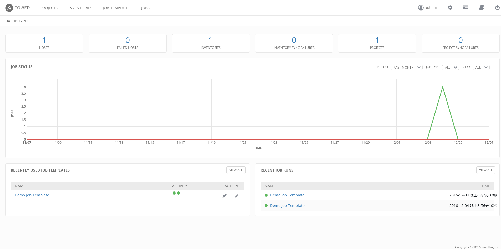

# 安装方法

如果你只是想体验下ansible tower，那么它的安装方法极其简单，只需要遵循以下步骤就可以了：


下面的方法把所有的ansible tower的组件，服务器，数据库都安装在一台机器上。准备一台RHEL7的裸机器，注册redhat。


1. 下载安装包 https://releases.ansible.com/ansible-tower/setup-bundle/
2. 编辑 inventory
3. 运行 ./setup.sh

  请注意tower对硬件的要求：
  http://docs.ansible.com/ansible-tower/3.0.3/html/installandreference/requirements_refguide.html#ir-requirements
 
4. 修改admin的密码
  
  ```
  tower-manage changepassword admin
  ```
  
5. 安装成功，访问你的ansible tower吧

  1. 如果你安装ansible tower的hostname是ansibletower.example.com, 那么访问 https://ansibletower.example.com/
  2. 用第4步的用户名和密码登陆
  3. 第一次登陆后，会提供你提供licences文件。
  

6. 申请Licences

  Ansible Tower提供了免费使用的Licences，永不过期。不过限制在管理10个一下主机，还有不能用一些LDAP等高级特性。不过这不影响我们体验和学习。去[这里](https://www.ansible.com/license)申请一个把。

7. 你的第一个页面

  
